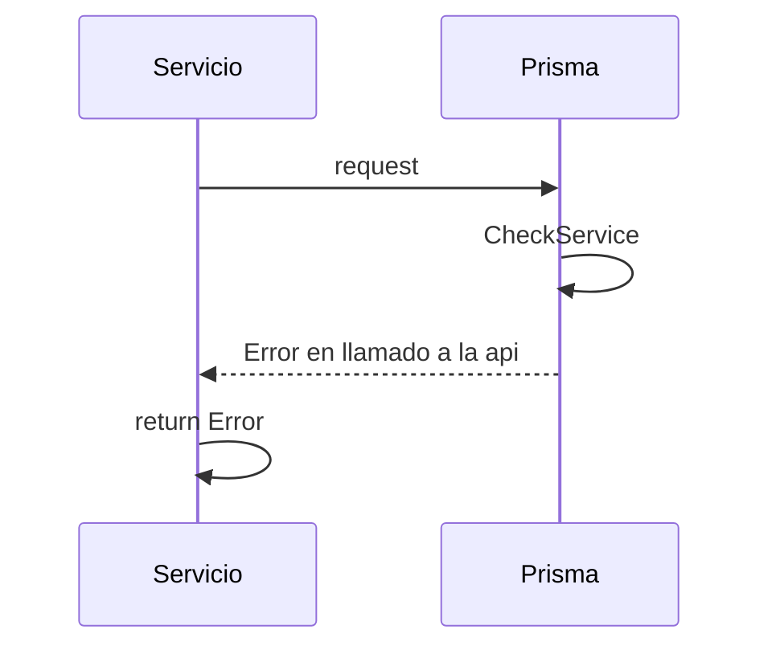

> # Check Prisma

## Error al consultar api de prisma
1. El proceso se inicia al llamar al servicio CheckPrisma
2. Se envía el request a la api de prisma
3. Devuelvo el Error de llamado a la api

***

