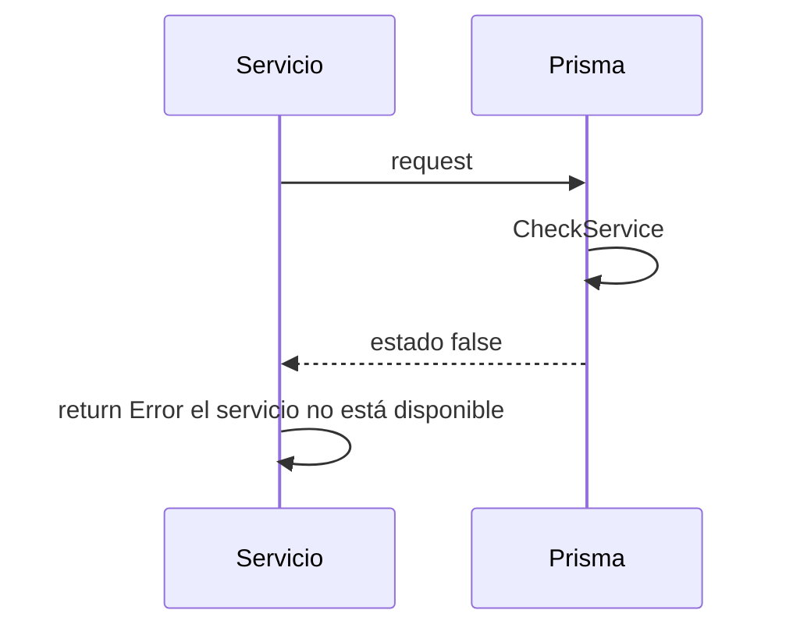

> # Check Prisma

## Error cuando api responde estado offline
1. El proceso se inicia al llamar al servicio CheckPrisma
2. Se envía el request a la api de prisma
3. La Api devuelve estado falso
4. Devuelve un error indicando el estado

***

