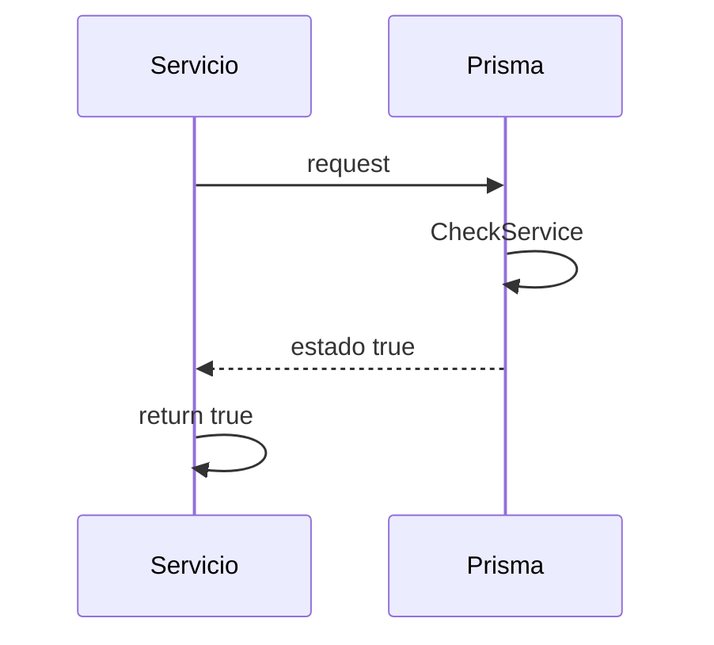

> # Check Prisma

## caso de exito cuando api responde estado online
1. El proceso se inicia al llamar al servicio CheckPrisma
2. Se envía el request a la api de prisma
3. La Api devuelve estado true
4. Devuelve el estado del servicio

***

