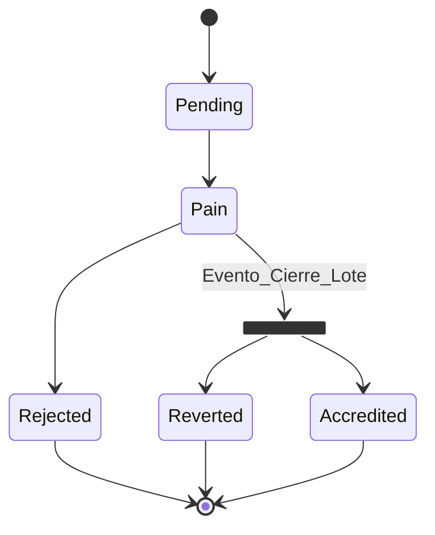

 # Diagrama de Estado
 ## Pago con Tarjeta Crédito/Débito

  stateDiagram-v2
      state fork_state <<fork>>
      state fork_state1 <<fork>>
      state fork_state2 <<fork>>
      [*] --> Pendiente: los pagos CREDITO, DEBITO, OFFLINE y DEBIN
      Pendiente--> fork_state:Evento_check-out
      fork_state-->Procesando:pagos OFFLINE y DEBIN
      fork_state-->Aprobado: pagos CREDITO y DEBITO
      Procesando-->fork_state1
      Aprobado-->fork_state2
      fork_state1-->Caducado:estado final
      fork_state1-->Autorizado:estado final
      fork_state1-->Rechazado:estado final
      fork_state1-->Revertido:estado final
      fork_state2-->Autorizado:estado final
      fork_state2-->Rechazado:estado final
      fork_state2-->Revertido:estado final
      Autorizado-->[*]
      Rechazado-->[*]
      Revertido-->[*]
      %% Caducado-->[*]