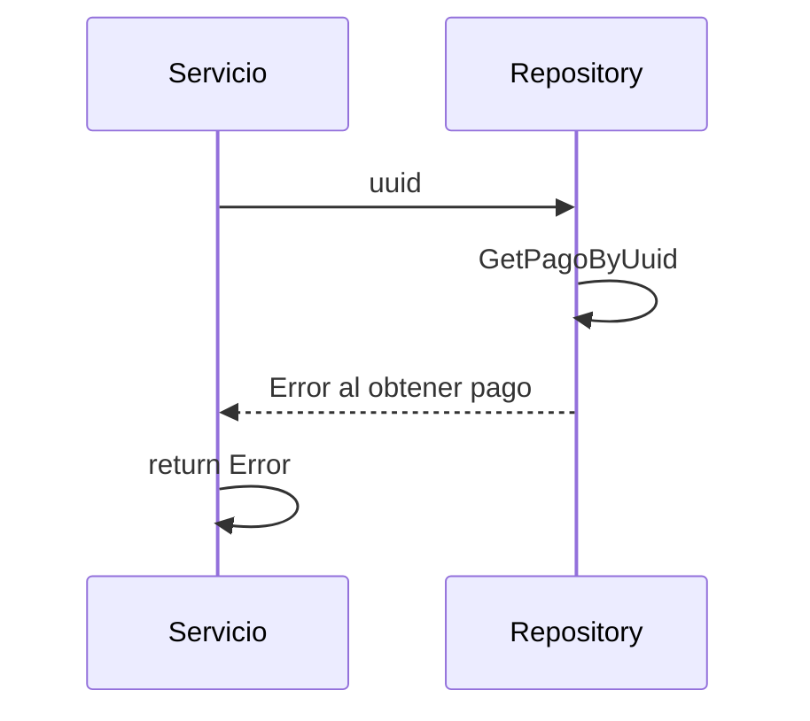

> # Get Billing

## error al obtener pago 
1. El proceso se inicia al llamar al servicio GetBilling
2. Se consulta al repositorio con el uuid
3. Devuelvo el Error si no puedo obtener pago

***

```mermaid
sequenceDiagram;
    participant S as Servicio
    participant R as Repository
    S ->> R: uuid
    R ->> R: GetPagoByUuid
    R -->> S: Error al obtener pago
    S ->> S: return Error 
        
```   