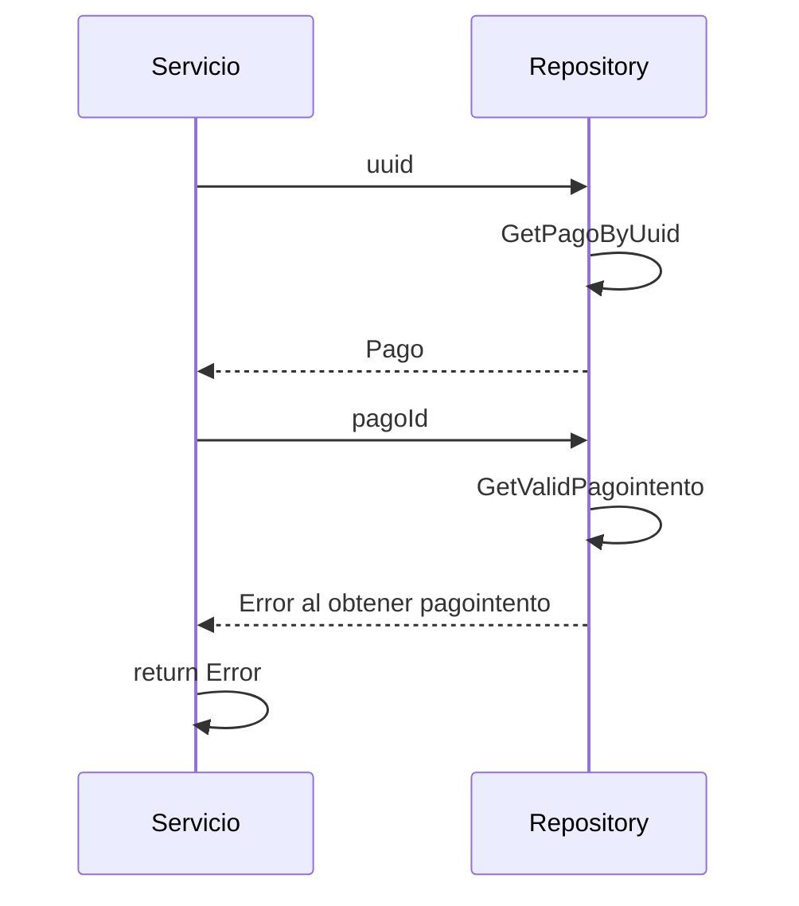

> # Get Billing

## error al obtener pago intento correcto
1. El proceso se inicia al llamar al servicio GetBilling
2. Se consulta al repositorio con el uuid
3. Consulta el pago intento asociado al pago correcto
4. Devuelve el error si no lo encuentra

***

