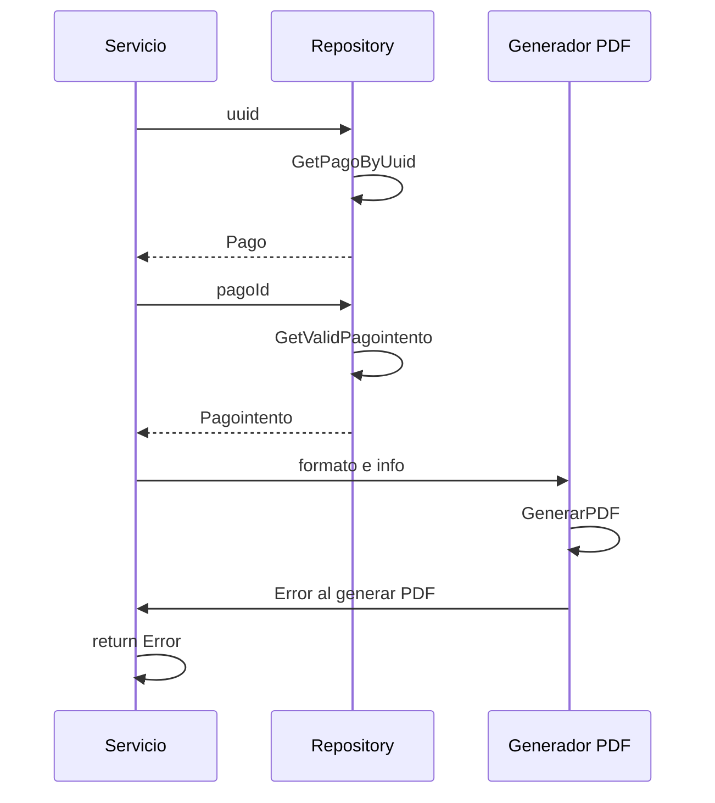

> # Get Billing

## error al generar el archivo pdf
1. El proceso se inicia al llamar al servicio GetBilling
2. Se consulta al repositorio con el uuid
3. Consulta el pago intento asociado al pago correcto
4. Agrega el formato con la información al generador de PDF
5. El generador de pdf devuelve un error
6. devuelve el error al frontend

***

