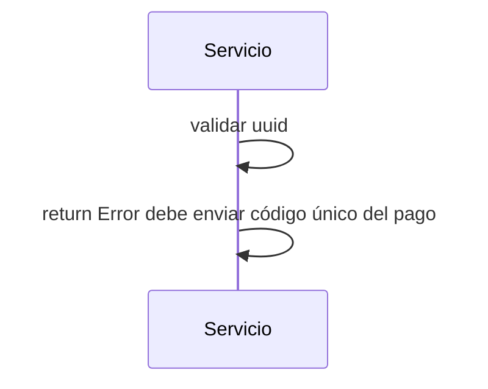

> # Get Pago 

## error de validación GetPago
1. El proceso se inicia al llamar al servicio GetPago
2. Se valida que se envíe un uuid en el parámetro
3. Devuelvo el Error debe enviar código único del pago

***

