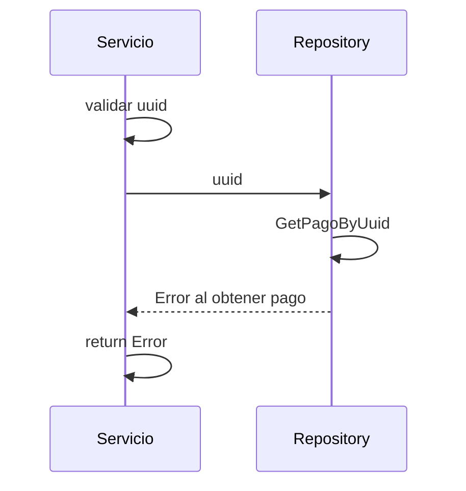

> # Get Pago 

## error obtener pago GetPago
1. El proceso se inicia al llamar al servicio GetPago
2. Se valida que se envíe un uuid en el parámetro
3. Obtengo el pago del repositorio con el uuid
4. Devuelvo el Error al obtener pago

***

