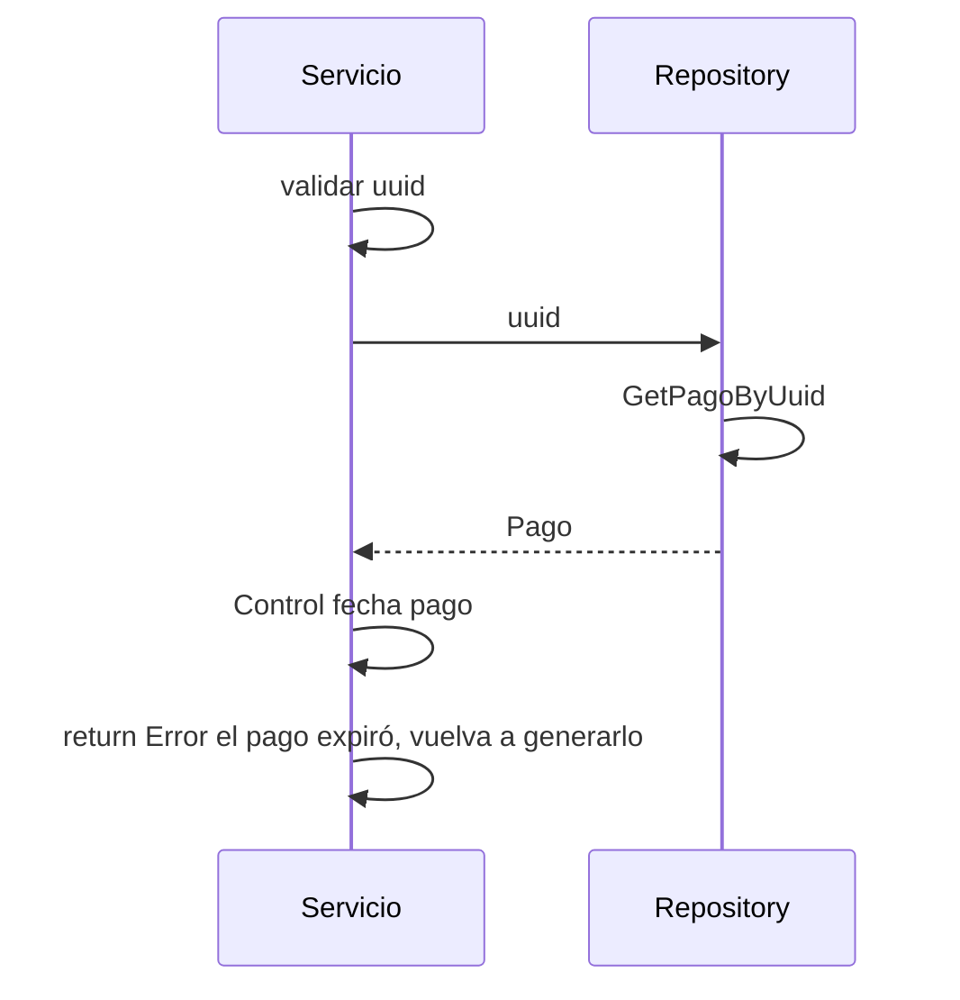

> # Get Pago 

## error pago expirado
1. El proceso se inicia al llamar al servicio GetPago
2. Se valida que se envíe un uuid en el parámetro
3. Obtengo el pago del repositorio con el uuid
4. Controlo que la creación del pago no haya pasado de 30 minutos
5. Devuelvo el Error el pago expiró, vuelva a generarlo

***

