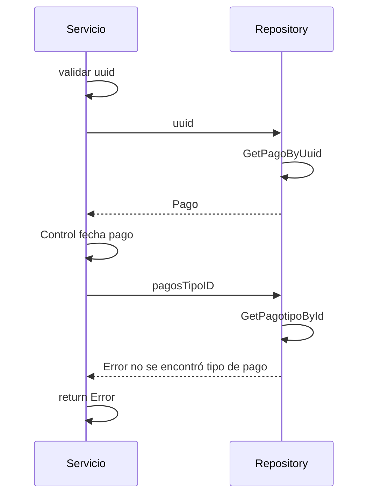

> # Get Pago 

## error tipo pago id
1. El proceso se inicia al llamar al servicio GetPago
2. Se valida que se envíe un uuid en el parámetro
3. Obtengo el pago del repositorio con el uuid
4. Controlo que la creación del pago no haya pasado de 30 minutos
5. Obtengo el tipo de pago del repositorio con el pagoTipoID
6. Devuelvo el Error no se encontró tipo de pago 

***

