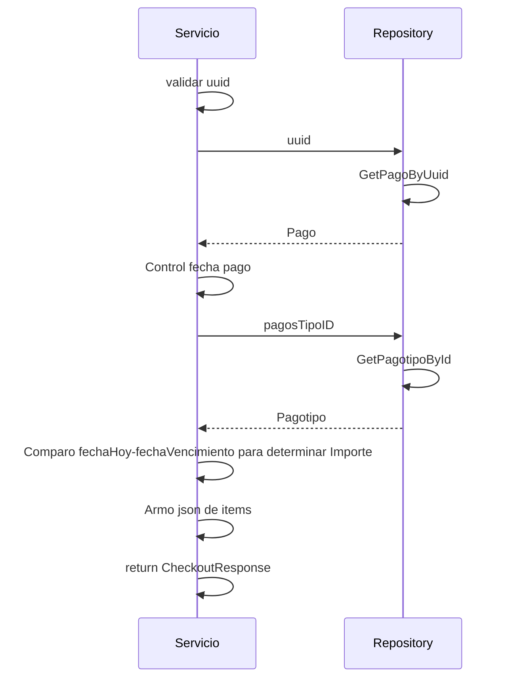

> # Get Pago 

## Caso de exito get pago
1. El proceso se inicia al llamar al servicio GetPago
2. Se valida que se envíe un uuid en el parámetro
3. Obtengo el pago del repositorio con el uuid
4. Controlo que la creación del pago no haya pasado de 30 minutos
5. Obtengo el tipo de pago del repositorio con el pagoTipoID
6. Comparo la fecha de vencimiento con la de hoy, si está vencido, asigno el SecondTotal como el importe a pagar
7. Tomo los items relacionados al pago y los convierto en json string

***

