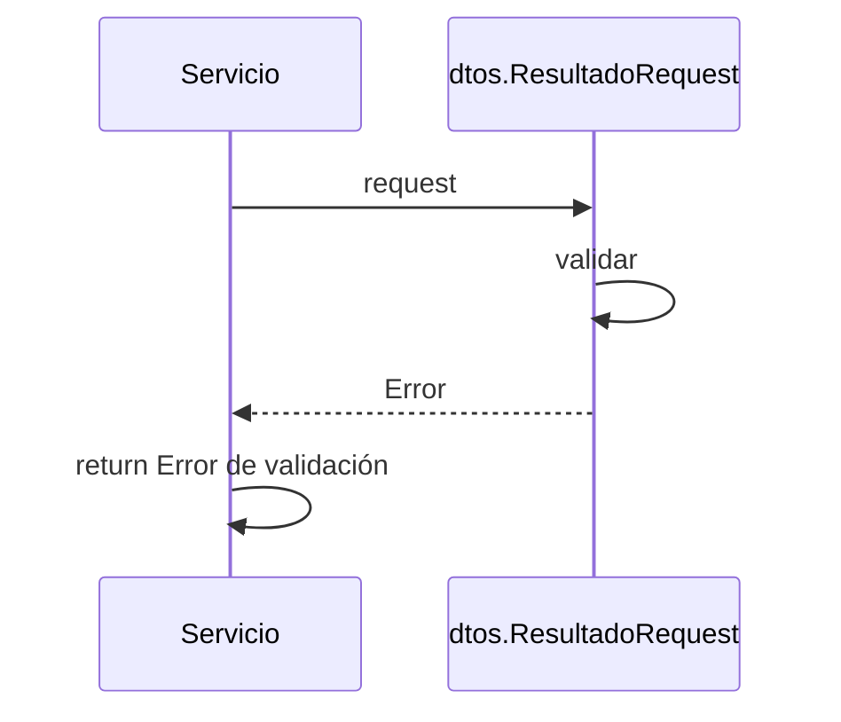

> # Get PagoResultado

## error de validación de pago
1. El proceso se inicia al llamar al servicio GetPagoResultado
2. Se valida que se envíen correctamente los parámetros
3. Devuelvo el error indicado 

***

