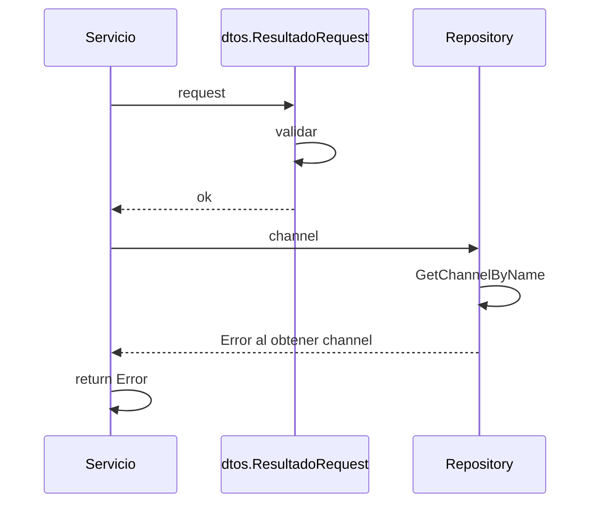

> # Get PagoResultado

## error al obtener el channel
1. El proceso se inicia al llamar al servicio GetPagoResultado
2. Se valida que se envíen correctamente los parámetros
3. Consulto datos del Channel en el repositorio 
4. Devuelvo error si no encuentro el channel

***

