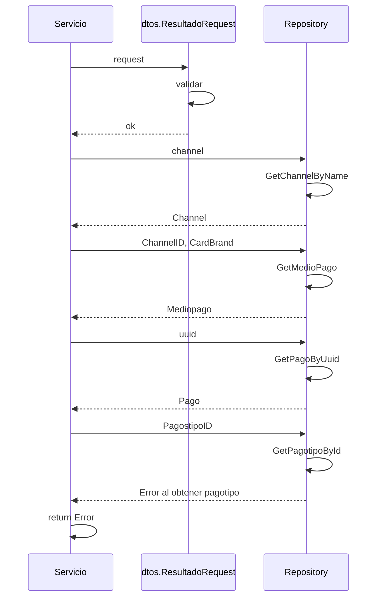

> # Get PagoResultado

## error al obtener el tipo de pago 
1. El proceso se inicia al llamar al servicio GetPagoResultado
2. Se valida que se envíen correctamente los parámetros
3. Consulto datos del Channel en el repositorio 
4. Consulto datos del medio de pago al repositorio
5. Consulto datos del pago mediante el uuid
6. Consulto datos del tipo de pago
7. Devuelvo error si no lo encuentra

***

