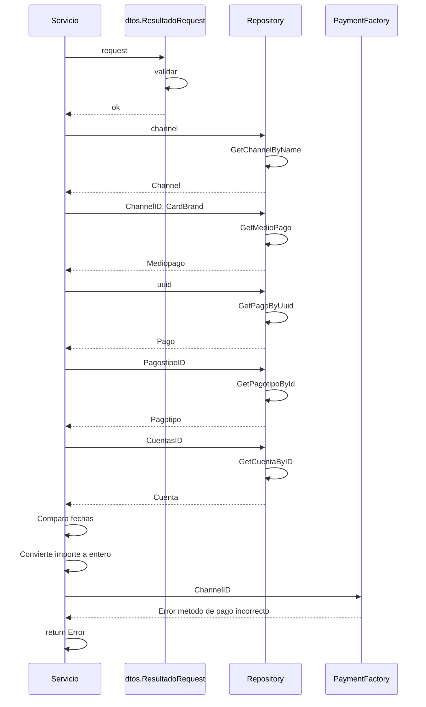

> # Get PagoResultado

## error al obtener metodo de pago
1. El proceso se inicia al llamar al servicio GetPagoResultado
2. Se valida que se envíen correctamente los parámetros
3. Consulta datos del Channel en el repositorio 
4. Consulta datos del medio de pago al repositorio
5. Consulta datos del pago mediante el uuid
6. Consulta datos del tipo de pago
7. Consulta datos de la cuenta 
8. Calcula importe a pagar según fechas de vencimiento
9. Convierte a entero el importe 
10. Obtiene el metodo de pago segun channelID
11. Devuelvo error si no se encuentra

***

