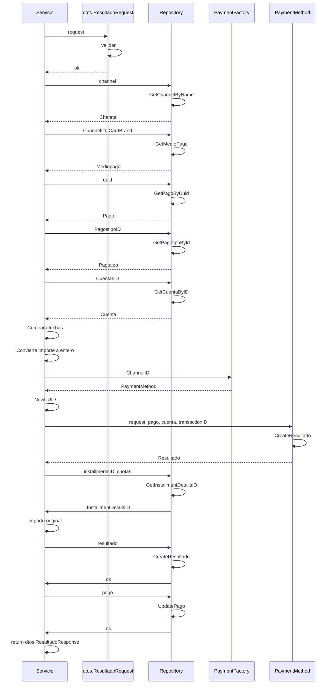

> # Get PagoResultado

## caso de exito get pago resultado
1. El proceso se inicia al llamar al servicio GetPagoResultado
2. Se valida que se envíen correctamente los parámetros
3. Consulta datos del Channel en el repositorio 
4. Consulta datos del medio de pago al repositorio
5. Consulta datos del pago mediante el uuid
6. Consulta datos del tipo de pago
7. Consulta datos de la cuenta 
8. Calcula importe a pagar según fechas de vencimiento
9. Convierte a entero el importe 
10. Obtiene el metodo de pago segun channelID
11. Genero un nuevo uuid para usarlo como TransactionID
11. Ejecuta el crear resultado del metodo obtenido
12. Agrega dato de installmentDetailsID al resultado
13. Agrega el importe con formato original al resultado
14. Almacena el resultado en el repositorio
15. Actualiza el estado del pago segun el resultado
16. Devuelve el objeto de respuesta para el frontend

***

