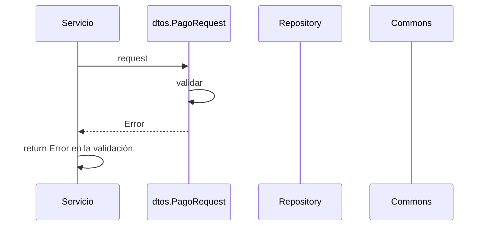

> # New Pago 

## Error validación new pago
1. El proceso se inicia al llamar al servicio NewPago
2. Se validan los datos enviados por parámetro en dtos.PageRequest.Validar()
3. Devuelvo el Error de la validación

***

