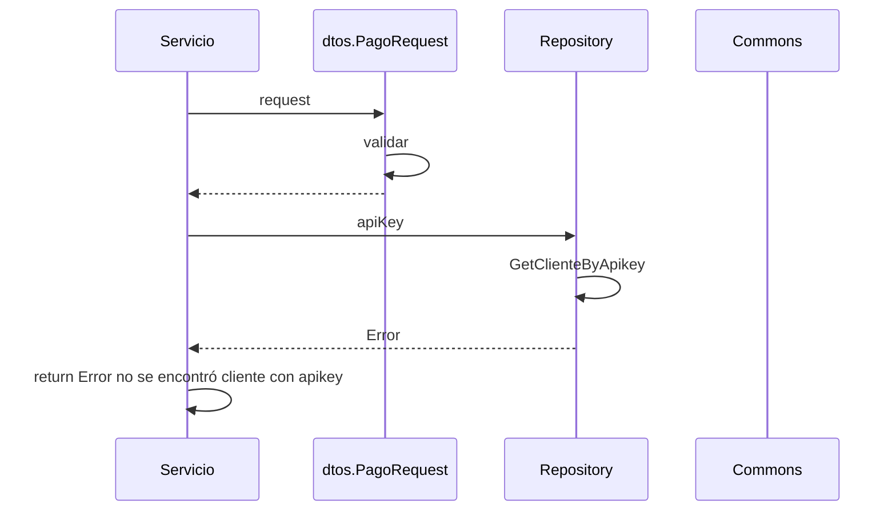

> # New Pago 

## error no se encuentra cliente new pago
1. El proceso se inicia al llamar al servicio NewPago
2. Se validan los datos enviados por parámetro en dtos.PageRequest.Validar()
3. Se busca el registro de cliente en el repositorio repository.GetClienteByApiKey(apiKey)
4. Devuelvo el Error no se encontró cliente con apikey

***

