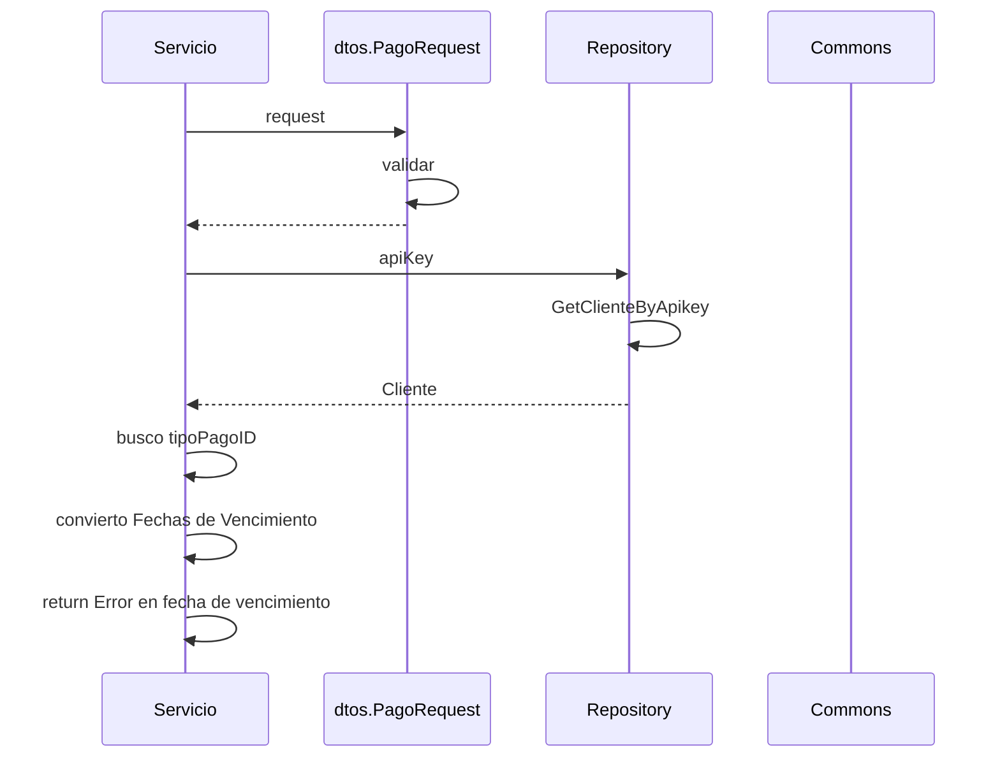

> # New Pago 

## Error en fechas de vencimientos new pago
1. El proceso se inicia al llamar al servicio NewPago
2. Se validan los datos enviados por parámetro en dtos.PageRequest.Validar()
3. Se busca el registro de cliente en el repositorio repository.GetClienteByApiKey(apiKey)
4. Busco el id del tipo de pago entre los Pagotipo del objeto Cliente
5. Convierto las Fechas de vencimiento de string a formato time
6. Devuelvo el Error en fecha de vencimiento

***

