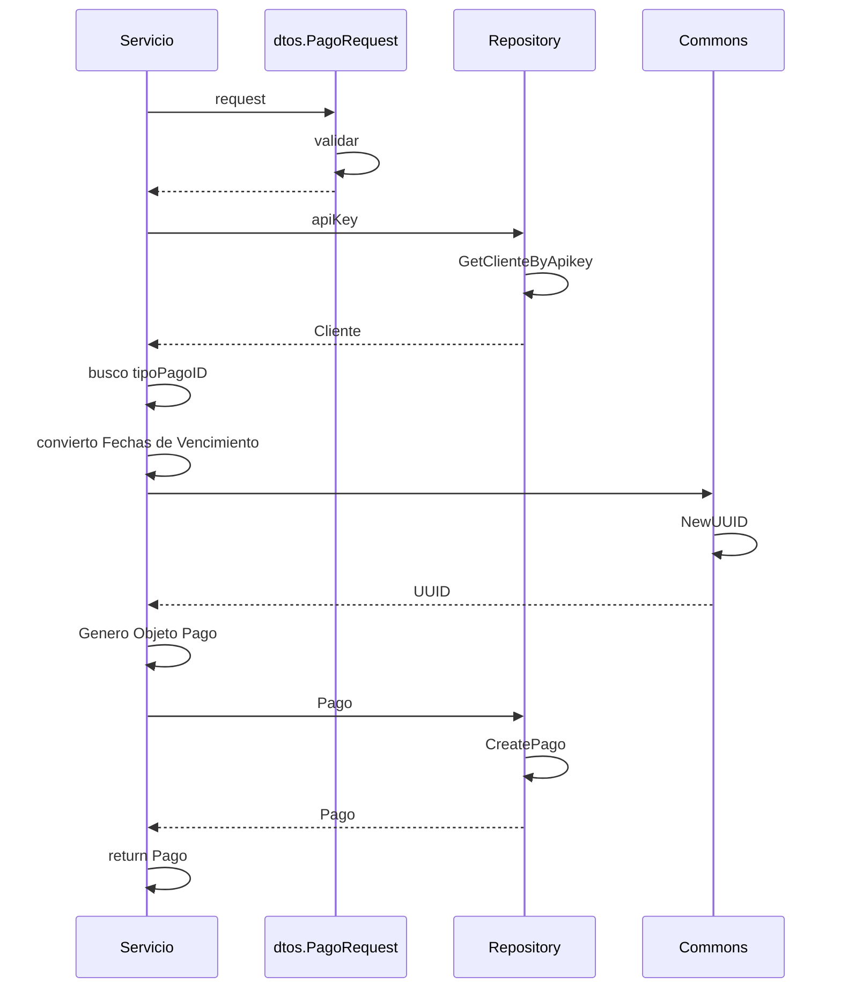

> # New Pago 

## Caso de exito new pago
1. El proceso se inicia al llamar al servicio NewPago
2. Se validan los datos enviados por parámetro en dtos.PageRequest.Validar()
3. Se busca el registro de cliente en el repositorio repository.GetClienteByApiKey(apiKey)
4. Busco el id del tipo de pago entre los Pagotipo del objeto Cliente
5. Convierto las Fechas de vencimiento de string a formato time
6. Genero un id unico con el servicio commons.NewUuid
7. Genero el nuevo objeto Pago
8. Envío el objeto pago al repositorio para que lo almacene en la base de datos
9. Devuelvo el objeto PagoResponse para uso del frontend

***

